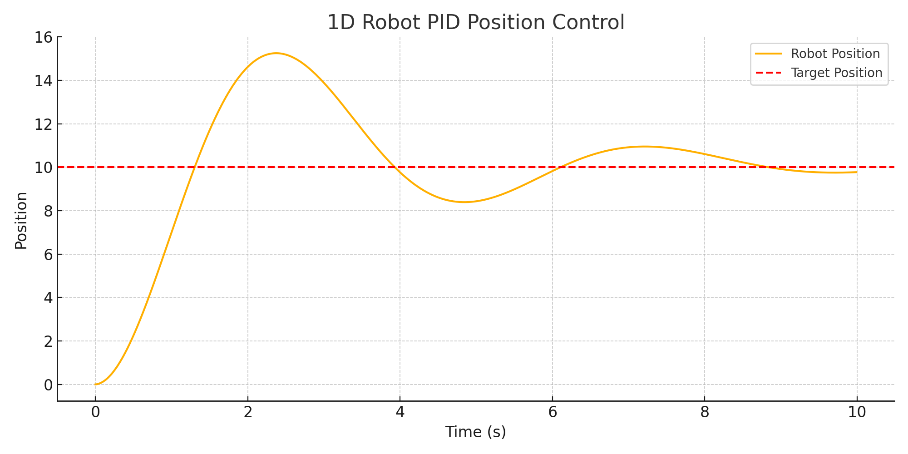

# PID Position Controller Simulation

This project simulates a 1D robot trying to reach a target position using a basic PID (Proportional–Integral–Derivative) control algorithm.

## Technologies Used
- Python
- NumPy
- Matplotlib

## Features
- Simple PID control loop
- Adjustable gains (Kp, Ki, Kd)
- Simulates physics of motion (acceleration → velocity → position)
- Visual plot showing how the controller brings the robot to the target

## Simulation Result



## How to Run
1. Clone the repo or copy the script:
```bash
python pid_position_controller.py
